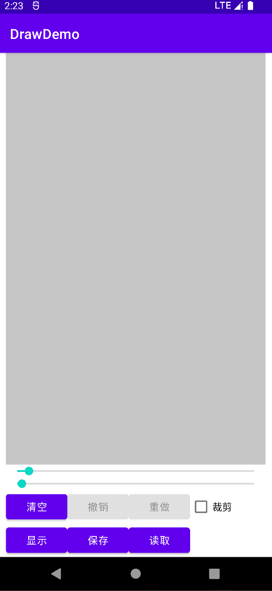

### DrawingView画图签名View

### 动画演示



#### 支持操作

- undo 撤销
- redo 重做
- clean 清空
- isEmpty 是否为空

### 支持类

```java
public interface DrawAction {   
    boolean redo();    
    boolean undo();    
    void clean();
    boolean isEmpty();
}
public class DrawingView extends View implements DrawAction, DrawActionLiveData {
    //...
}
```

### 支持属性

```xml
<declare-styleable name="DrawingView">
    <!--线宽-->
    <attr name="lineWidth" format="dimension" />
    <!--线条颜色-->
    <attr name="lineColor" format="color" />
    <!--识别最小移动距离 画笔越小越灵敏, 画出的图案越接近实际轨迹-->
    <attr name="minLength" format="integer" />
</declare-styleable>
```

### 监听状态

```java
public interface DrawingStatusListener {   
    /**     
    * 通过两个参数判断是否可以撤销和重做     
    *     
    * @param drawCount 当前画图次数 大于0可以undo操作     
    * @param redoCount 撤销的次数 大于0可以redo     
    */    
    void onDrawStatus(int drawCount, int redoCount); 
     /**
     * 每次画完一次轨迹后都会调用
     */
    void onDrawComplete();
}
```

### 支持lifecycle

```java
public interface DrawActionLiveData {

    /**
     * @param owner
     * @param count 撤销次数
     */
    void observeUndo(LifecycleOwner owner, Observer<Integer> count);

    /**
     * @param owner
     * @param count 重做次数
     */
    void observerRedo(LifecycleOwner owner, Observer<Integer> count);
}
```

### gradle依赖

```groovy
implementation 'io.github.masterfans:drawingView:1.0.1@aar'
```

